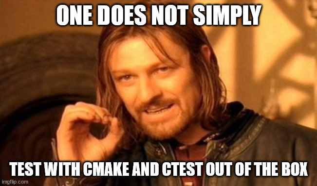
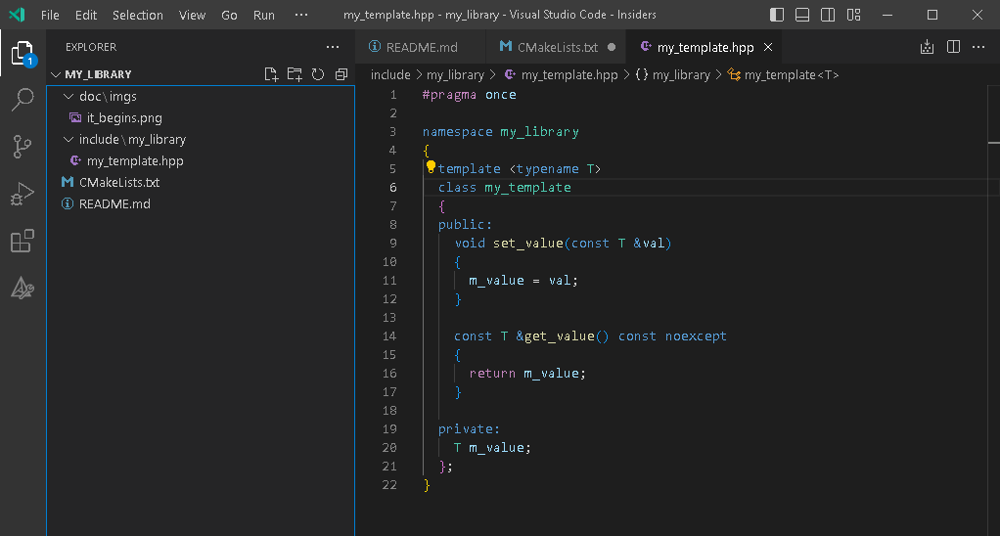
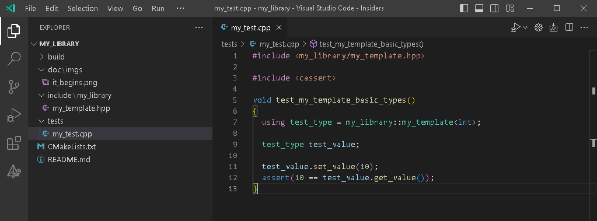
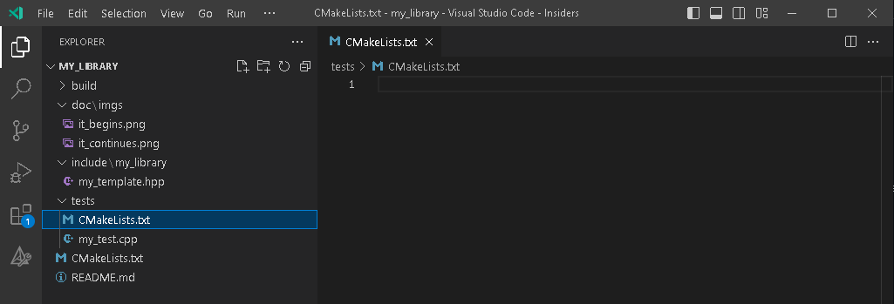
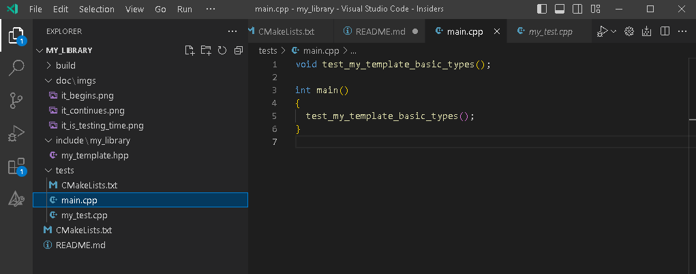
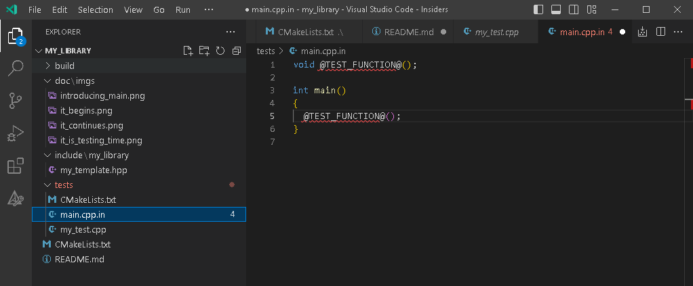
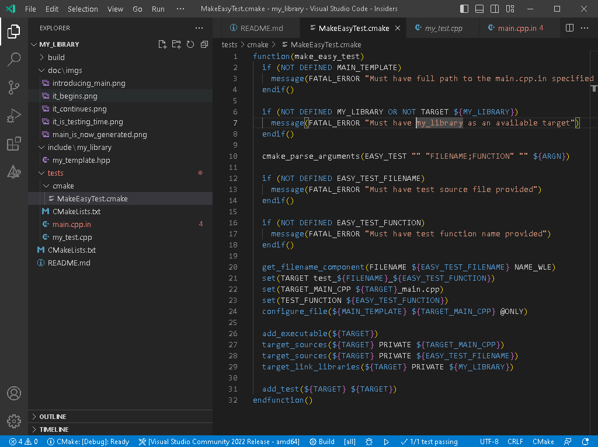
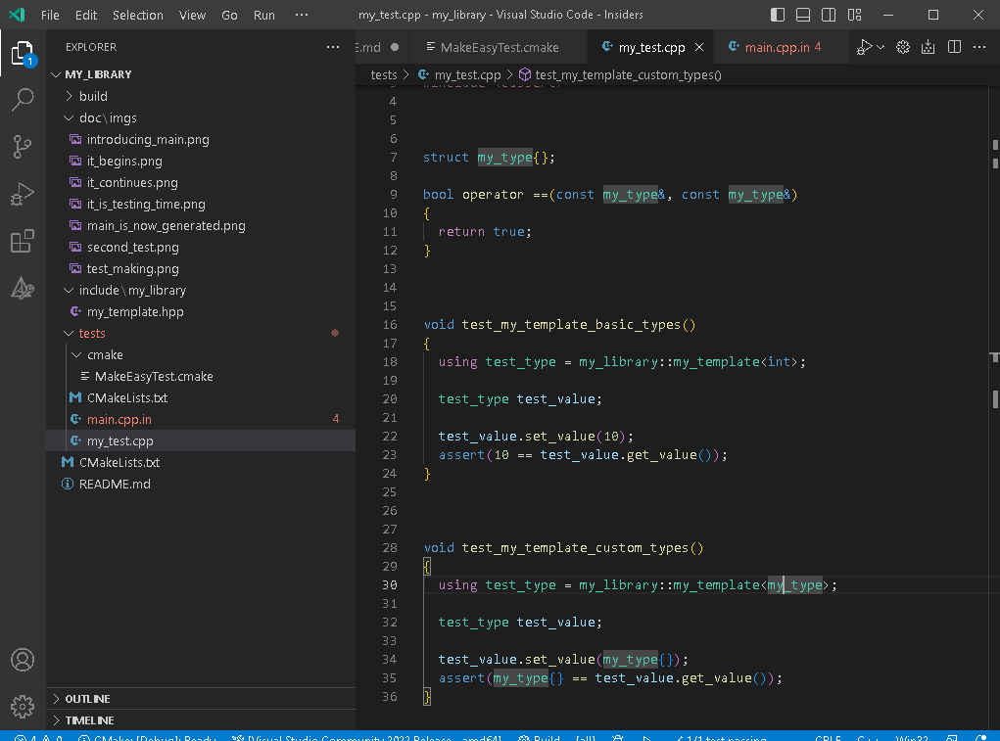
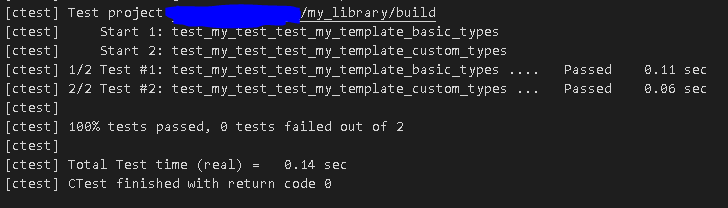

[](https://github.com/ImaginaryExponent/my_library/actions/workflows/cmake.yml)

Thank you kindly, [Victor](https://www.linkedin.com/in/victor-istomin-b753b666), for the review and critique.

# Convenient testing at a small scale.


Everyone knows testing is vital. It helps to figure out the interactions between the components of the system and to try out various scenarios making sure they work. GTest and Catch2 as well as many others were not developed out of curiosity or boredom.

However, I don't know about you, but I find it a bit counterintuitive to bring a whole testing framework into a project when it is only a few classes large and there is no guarantee something will grow out of it. For something large - sure, when the codebase size does outweigh the size of the testing framework it no longer feels like overkill. 


This is an example of what can be done about testing when the project is in its earliest stages.

# Everything starts somewhere
>although many physicists disagree.

Let's assume we are developing a small utility library. We have a C++ toolchain at our disposal and we rely on CMake to give us a hand with the whole building thing. CMake usually brings a friend along, so I will assume CTest is also available.

We will call our new creation "my_library", because it clearly indicates the intent of being subject of nefarious experiments and because naming is **difficult**.


Keeping the naming scheme consistent, my_template.hpp header contains the my_template class full of vital functionality that we are going to be desperate to test. 

Before we jump head first into CMaking, feel free to read a small [recap](./doc/Basics.md) that you are welcome to skip if you know what a `target` is. The script that will handle our library is neither large nor complex. And even here some of the commands are not mandatory.

```CMake
# Version 3.13 was picked randomly. 
# No actual analysis regarding minimal sufficient versions was done.
cmake_minimum_required(VERSION 3.13 FATAL_ERROR)

# Naming is DIFFICULT
project(my_library VERSION 0.1)

# A header-only library, so create it as an "INTERFACE" target
add_library(my_library INTERFACE)
# Standard picked randomly to indicate some usual build parameters.
target_compile_features(my_library INTERFACE cxx_std_23)
# Ask Microsoft toolchain specifically to disable the language extensions.
target_compile_options(my_library INTERFACE $<$<CXX_COMPILER_ID:MSVC>:/Za>)
# Append the directory where the library headers can be found to the list of the include directories.
target_include_directories(my_library INTERFACE $<BUILD_INTERFACE:${CMAKE_CURRENT_SOURCE_DIR}/include> $<INSTALL_INTERFACE:include>)

# I prefer assigning source files to the target individually. 
# May become cumbersome later, but at least I see what is and what isn't used.
target_sources(my_library INTERFACE ${CMAKE_CURRENT_SOURCE_DIR}/include/my_library/my_template.hpp)
```

While this hasn't been intended in the CMake script above I inadvertently touched on two subjects and [here](./doc/Advanced.md) is the obligatory shoutout.

You can try building our folder at this point to double check or just believe me when I say that it is buildable. Granted, it does not produce any artifacts worth noting, but the whole thing is on the right track.

# Now, how do we go about testing?


The project can be successfully built with CMake and that just confirms that the CMakeLists.txt script is correct. But that is not enough for us, for we want to make sure the code is also usable and works as designed.

No two ways about it, we have to go and try using the thing. So let's introduce some code that will attempt to use our library as it is intended. We create an obligatory "tests" folder and continue our experiments there composing something resembling a use case.



I know this looks extremely simplistic for now, but that is the intention. I would like to outlie a few points visible even in this trivial example:

* The testing code has no other limitations or dependencies but those caused by the library we are testing. This is as close to the actual use conditions as is possible. With both pros and cons that entails.
* Naming patterns and guidelines apply, but naming is **difficult**. I strive to make something like
  ```CMake
  void test_${subject}_${specifics}();
  ```
  but may fail preventing that from growing into something unreadable.

# CMake should know about it!

We created the `my_test.cpp` with its `test_my_template_basic_types` call, but the file is not yet introduced to the build. Nor can it compile into anything executable, there is no `main` function, and the tests for CTest are supposed to be executables. Let's work on that. 

We alter the root [CMakeLists.txt](./CMakeLists.txt) to enable testing and politely ask the CMake to take a look into the newly added [tests](./tests) subdirectory.
```CMake
cmake_minimum_required(VERSION 3.13 FATAL_ERROR)

project(my_library VERSION 0.1)

# The testing is now enabled!
enable_testing()

add_library(my_library INTERFACE)
target_compile_features(my_library INTERFACE cxx_std_23)
target_compile_options(my_library INTERFACE $<$<CXX_COMPILER_ID:MSVC>:/Za>)
target_include_directories(my_library INTERFACE $<BUILD_INTERFACE:${CMAKE_CURRENT_SOURCE_DIR}/include> $<INSTALL_INTERFACE:include>)

target_sources(my_library INTERFACE ${CMAKE_CURRENT_SOURCE_DIR}/include/my_library/my_template.hpp)

# Would you kindly take a look into this directory as well?
add_subdirectory(tests)
```
We also provide something useful for the CMake to find there, hence the as of yet empty new [tests/CMakeLists.txt](./tests/CMakeLists.txt).


# Creating executables for the tests.

Time to turn the lonely [tests/my_test.cpp](./tests/my_test.cpp) into something runnable. To do so, we add a new source file that will contain our `main` function.


We also populate the [tests/CMakeLists.txt](./tests/CMakeLists.txt) creating a target for the test executable and registering it as a test.

```CMake
# Create the testing executable.
add_executable(test_my_template_basic_types)
# Registering main.cpp as a part of it.
target_sources(test_my_template_basic_types PRIVATE ${CMAKE_CURRENT_SOURCE_DIR}/main.cpp)
# Registering the testing call as a part of it.
target_sources(test_my_template_basic_types PRIVATE ${CMAKE_CURRENT_SOURCE_DIR}/my_test.cpp)
# Connecting our library to the test executable.
# CMake will take care of supplying the include directories and linking binaries if needed.
target_link_libraries(test_my_template_basic_types PRIVATE my_library)
# Finally register the executable we created as a test.
add_test(test_my_template_basic_types test_my_template_basic_types)
```

**Success!!** It is at this point that we can build the whole thing and run the test. Singular, for now, but we've achieved our goal of having a test for our library. 

# You require more ~~minerals~~  tests!

Just one test seems a bit on the "insufficient" side of the coverage scale, even for this tiny library. So, let's focus on the tests.

Consider the steps that are necessary to add another test:
- [ ] A new testing function is needed.
- [ ] A new testing source file will eventually be needed, to keep the testing functions isolated and grouped.
- [ ] A new `main` function, or rather, a whole new `main.cpp` will be needed because the existing one is used by the existing test call.
- [ ] A new executable is needed to allow tracking from the CTest side.

On one hand that is a whole lot of work. On the other hand, CMake has some nice helper calls for exactly that kind of task.

## create_test_sourcelist, why oh why don't you work just a little bit differently?

Now would be a good place to mention one CTest function that could have helped us. `create_test_sourcelist` is designed to combine multiple source files, extract the testing functions akin to our `test_my_template_basic_types` call and use those as individual tests. Unfortunately, some of the requirements, like having testing call name match file name, severely decrease its usability. This name matching requirement alone means the test calls are limited to one per `*.cpp`. And for a bunch of tests that have a common setup and teardown process this is too much of a hassle. 

What we require is a simple way of making executables from the individual `*.cpp` files, each invoking just one specific test function. 

It would bring the benefit of having a single `*.cpp` file dedicated to the testing of some functionality and allow having all of the required scaffolding right there next to the test calls. And being able to convert the individual function calls into executables makes them tracked by the CTest. Which in turn allows parallel execution and run time monitoring.

## We've got an idea, so...


It is surprisingly easy. We will rely on a CMake function called `configure_file`. It generates a file from a template while replacing stuff in it with the values of the available CMake variables. Perfect for the purposes of our `main.cpp` and its single testing call. So, we replace the `main.cpp` with [tests/main.cpp.in](./tests/main.cpp.in) and replace `test_my_template_basic_types` in it with `@TEST_FUNCTION@`. Later on the `configure_file` call will in turn replace `@TEST_FUNCTION@` with whatever we ask it to.


Let us make a dedicated CMake function that will take care of this whole process. Create a [tests/cmake](./tests/cmake) folder and add a `MakeEasyTest.cmake` file there. Naming the folder with the CMake utilities `cmake` is a generally accepted guideline. 


Wow this looks complicated! 

But that is just that. Just looks. Half of the code is validation and argument parsing which are supplemental to the cause. The test target name generation is not something I am proud of but it is one of many ways to do it. And the core of the function is the last five lines. Luckily, you won't have to look into it ever again once you have it in place.

Let me comment on the code step by step.
```CMake
# Naming is DIFFICULT
function(make_easy_test)
  # Someone has to hold the path to the main.cpp.in. 
  # ${MAIN_TEMPLATE} variable that we expect to exist in the calling scope will do. 
  if (NOT DEFINED MAIN_TEMPLATE)
    message(FATAL_ERROR "Must have full path to the main.cpp.in specified in the MAIN_TEMPLATE")
  endif()

  # I should have just checked if my_library is a target and been done.
  # Oh well. Simplifying this is left as homework!
  if (NOT DEFINED MY_LIBRARY OR NOT TARGET ${MY_LIBRARY})
    message(FATAL_ERROR "Must have my_library as an available target")
  endif()

  # I prefer this way of argument parsing because it is flexible.
  # We expect no optional args, two single-valued args and no multi-valued ones.
  cmake_parse_arguments(EASY_TEST "" "FILENAME;FUNCTION" "" ${ARGN})
  
  # We need to get the name of the *.cpp with the test function.
  if (NOT DEFINED EASY_TEST_FILENAME)
    message(FATAL_ERROR "Must have test source file provided")
  endif()
  
  # We also need to get  the name of that test function.
  if (NOT DEFINED EASY_TEST_FUNCTION)
    message(FATAL_ERROR "Must have test function name provided")
  endif()

  # An attempt to establish a test naming pattern.
  # test_${subject}_${specifics} is implemented as
  # test_${filename}_${fumction}. 
  get_filename_component(FILENAME ${EASY_TEST_FILENAME} NAME_WLE)
  set(TARGET test_${FILENAME}_${EASY_TEST_FUNCTION})
  # Compose a filename for the generated *.cpp with the "main".
  set(TARGET_MAIN_CPP ${TARGET}_main.cpp)
  # Create a variable with the test function name. 
  # IMPORTANT: TEST_FUNCTION matches exactly the @TEST_FUNCTION@ in the main.cpp.in.
  # Must be so for the configure_file to replace things.
  set(TEST_FUNCTION ${EASY_TEST_FUNCTION})
  # Perform the generation. 
  configure_file(${MAIN_TEMPLATE} ${TARGET_MAIN_CPP} @ONLY)
  
  # Create the test executable
  add_executable(${TARGET})
  # Feed it the generated file with "main" function
  target_sources(${TARGET} PRIVATE ${TARGET_MAIN_CPP})
  # And feed it the file with the actual test function
  target_sources(${TARGET} PRIVATE ${EASY_TEST_FILENAME})
  # Depend it on the library we are testing
  target_link_libraries(${TARGET} PRIVATE ${MY_LIBRARY}) 
  
  # And register our test!
  add_test(${TARGET} ${TARGET})
endfunction()
```

## Bringing it all together.

There isn't much left to do. We need to include the [MakeEasyTest.cmake](./tests/cmake/MakeEasyTest.cmake) where necessary and just call it to create tests.

For the purposes of illustration let's create another test function first.


Now to update the [tests/CMakeLists.txt](./tests/CMakeLists.txt).
```CMake
# Include the test-making "header"
include( ${CMAKE_CURRENT_SOURCE_DIR}/cmake/MakeEasyTest.cmake)

# Provide necessary variables for the function call.
set(MY_LIBRARY my_library)
set(MAIN_TEMPLATE ${CMAKE_CURRENT_SOURCE_DIR}/main.cpp.in)

# Create the actual tests.
make_easy_test(FILENAME ${CMAKE_CURRENT_SOURCE_DIR}/my_test.cpp FUNCTION test_my_template_basic_types)
make_easy_test(FILENAME ${CMAKE_CURRENT_SOURCE_DIR}/my_test.cpp FUNCTION test_my_template_custom_types)
```

# Done.



At this point if you build the root folder you get two tests instead of one. And there was never an extra `main` function among the tests. And the rebuilding should not be an issue since the `*.cpp` files do not change when you build different tests from them using this approach; they should only require compilation once.

It may not look significant on just two tests, but on about fifty the benefits become more apparent. All at the cost of a single CMake function and a trivial source file template. And should we at some point go to a full-fledged testing framework, all of the tests created in this manner can be easily reused, they are just functions after all.

# Afterthoughts.

Sometimes you will want some custom calls for the special kind of validation required in your codebase. 

For instance, you may want to check that your template metafunctions transform the argument types in exactly the way you intend them to. The test in that case would be based on `static_assert` and just the fact that code compiled successfully would be a pass. However, for something like that having just a `static_assert(std::is_same_v<T1, T2>, "Error");` may not be sufficiently convenient.

In any case some test utilities will naturally come to be. But it is not yet clear how to integrate them into the test targets that we make via a function call.

However it is a simple issue to solve since we can create a CMake target with the test utilities and either
* just directly `target_link_libraries` test utilities into the test target

or

* Extend the `make_easy_test` argument parsing to accept another one
* Pass the test utility target as an optional argument to `make_easy_test`
* `target_link_libraries` that argument into the test target.

The latter has the bonus of control whether or not the dependence on the test utilities is necessary. And offers flexibility regarding what utilities to depend on. Multiple extra targets can be linked into the test in this manner, just make a multi-valued function argument.

# Conclusion

At the price of a single CMake function and a single file template we can get a convenient, debuggable and extendable set of tests without any third party libraries. 
