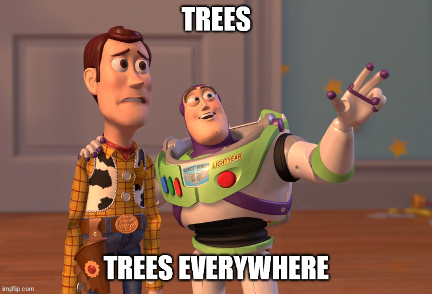

# CMake is all about trees. Of targets.

CMake's purpose in life is to create various scripts from CMake code. And then run them. And then handle the execution results. And maybe report errors. From a single script on multiple platforms. Versatile, isn't it?

But deep down it goes with a rather simple idea: 

Codebase is a tree in the file system, individual components form a tree of dependencies, binary installation corresponds to the file system tree, and so on. That means if we learn to operate on the trees effectively, we can do a lot with the codebases. 

CMake is good at operating on trees by letting the user focus mostly on the nodes and require minimal info about the edges. 

Nodes of the tree in CMake are `target`s. Developers define `target`s they require via `add_library` or `add_executable`, describe them, establish relations and dependencies via `target_link_library` (C++ linker is distantly related). Then CMake makes sure the `target`s each get required input, taking into account transitivity, visibility and many other complicated words, which are out of scope here.

For the purposes of this specific tutorial that should suffice.